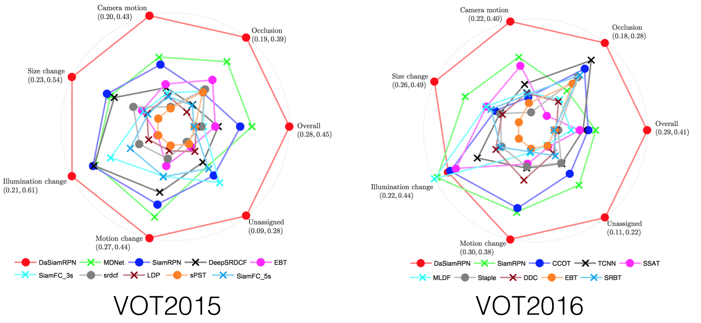

:trophy:News: **We won the VOT-18 real-time challenge**

:trophy:News: **We won the second place in the VOT-18 long-term challenge**

# DaSiamRPN

This repository includes PyTorch code for reproducing the results on VOT2018.

[**Distractor-aware Siamese Networks for Visual Object Tracking**](https://arxiv.org/pdf/1808.06048.pdf)  

Zheng Zhu<sup>\*</sup>, Qiang Wang<sup>\*</sup>, Bo Li<sup>\*</sup>, Wei Wu, Junjie Yan, and Weiming Hu 

*European Conference on Computer Vision (ECCV), 2018*


## Introduction

**SiamRPN** formulates the task of visual tracking as a task of localization and identification simultaneously, initially described in an [CVPR2018 spotlight paper](http://openaccess.thecvf.com/content_cvpr_2018/papers/Li_High_Performance_Visual_CVPR_2018_paper.pdf). (Slides at [CVPR 2018 Spotlight](https://drive.google.com/open?id=1OGIOUqANvYfZjRoQfpiDqhPQtOvPCpdq))

**DaSiamRPN** improves the performances of SiamRPN by (1) introducing an effective sampling strategy to control the imbalanced sample distribution, (2) designing a novel distractor-aware module to perform incremental learning, (3) making a long-term tracking extension. [ECCV2018](https://arxiv.org/pdf/1808.06048.pdf). (Slides at [VOT-18 Real-time challenge winners talk](https://drive.google.com/open?id=1dsEI2uYHDfELK0CW2xgv7R4QdCs6lwfr))

<div align="center">
  
</div>

## Prerequisites

CPU: Intel(R) Core(TM) i7-7700 CPU @ 3.60GHz
GPU: NVIDIA GTX1060

- python2.7
- pytorch == 0.3.1
- numpy
- opencv


## Pretrained model for SiamRPN

In our tracker, we use an AlexNet variant as our backbone, which is end-to-end trained for visual tracking.
The pretrained model can be downloaded from google drive: [SiamRPNBIG.model](https://drive.google.com/file/d/1-vNVZxfbIplXHrqMHiJJYWXYWsOIvGsf/view?usp=sharing).
Then, you should copy the pretrained model file `SiamRPNBIG.model` to the subfolder './code', so that the tracker can find and load the pretrained_model.


## Detailed steps to install the prerequisites

- install pytorch, numpy, opencv following the instructions in the `run_install.sh`. Please do **not** use conda to install.
- you can alternatively modify `/PATH/TO/CODE/FOLDER/` in `tracker_SiamRPN.m` 
  If the tracker is ready, you will see the tracking results. (EAO: 0.3827)


## Results
All results can be downloaded from [Google Drive](https://drive.google.com/drive/folders/1HJOvl_irX3KFbtfj88_FVLtukMI1GTCR?usp=sharing).

| | <sub>VOT2015</br>A / R / EAO</sub> | <sub>VOT2016</br>A / R / EAO</sub> | <sub>VOT2017 & VOT2018</br>A / R / EAO</sub> | <sub>OTB2015</br>OP / DP</sub> | <sub>UAV123</br>AUC / DP</sub> | <sub>UAV20L</br>AUC / DP</sub> |
| :-: | :-: | :-: | :-: | :-: | :-: | :-: |
| <sub> **SiamRPN** </br> CVPR2017 </sub> | <sub>0.58 / 1.13 / 0.349<sub> | <sub>0.56 / 0.26 / 0.344<sub> | <sub>0.49 / 0.46 / 0.244<sub> | <sub>81.9 / 85.0<sub> | <sub>0.527 / 0.748<sub> | <sub>0.454 / 0.617<sub> |
| <sub> **DaSiamRPN** </br> ECCV2018 </sub> | <sub>**0.63** / **0.66** / **0.446**<sub> | <sub>**0.61** / **0.22** / **0.411**<sub> | <sub>0.56 / 0.34 / 0.326<sub> | <sub>**86.5** / **88.0**<sub> | <sub>**0.586** / **0.796**<sub> | <sub>**0.617** / **0.838**<sub> |
| <sub> **DaSiamRPN** </br> VOT2018 </sub> | <sub>-<sub> | <sub>-<sub>  | <sub>**0.59** / **0.28** / **0.383**<sub> | <sub>-<sub> | <sub>-<sub> | <sub>-<sub> |


# Demo and Test on OTB2015
<div align="center">
  
</div>

- To reproduce the reuslts on paper, the pretrained model can be downloaded from [Google Drive](https://drive.google.com/open?id=1BtIkp5pB6aqePQGlMb2_Z7bfPy6XEj6H): `SiamRPNOTB.model`. <br />
:zap: :zap: This model is the **fastest** (~200fps) Siamese Tracker with AUC of 0.655 on OTB2015. :zap: :zap: 

- You must download OTB2015 dataset (download [script](code/data/get_otb_data.sh)) at first.

A simple test example.

```
cd code
python demo.py
```

If you want to test the performance on OTB2015, please using the follwing command.

```
cd code
python test_otb.py
python eval_otb.py OTB2015 "Siam*" 0 1
```


# License
Licensed under an MIT license.


## Citing DaSiamRPN

If you find **DaSiamRPN** and **SiamRPN** useful in your research, please consider citing:

```
@inproceedings{Zhu_2018_ECCV,
  title={Distractor-aware Siamese Networks for Visual Object Tracking},
  author={Zhu, Zheng and Wang, Qiang and Bo, Li and Wu, Wei and Yan, Junjie and Hu, Weiming},
  booktitle={European Conference on Computer Vision},
  year={2018}
}

@InProceedings{Li_2018_CVPR,
  title = {High Performance Visual Tracking With Siamese Region Proposal Network},
  author = {Li, Bo and Yan, Junjie and Wu, Wei and Zhu, Zheng and Hu, Xiaolin},
  booktitle = {The IEEE Conference on Computer Vision and Pattern Recognition (CVPR)},
  year = {2018}
}
```
